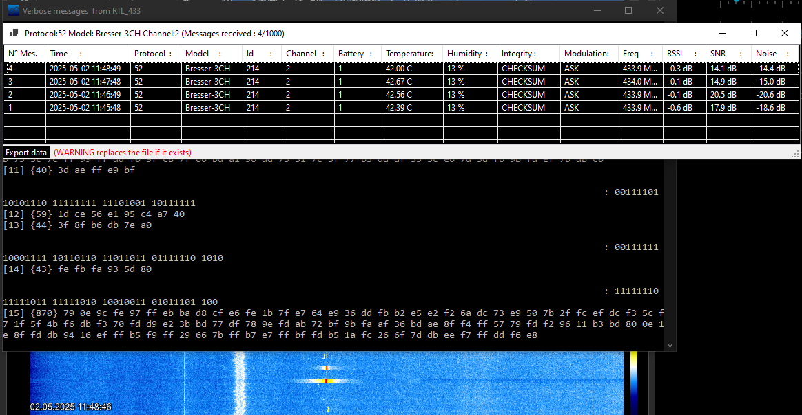

## Concepts

### BresserProtocol
Decoding is based on [rtl_433](https://github.com/merbanan/rtl_433), reception with SDRsharp and an Airspy R2 receiver.

#### Receiver
Some proof of concept for receiving the data packets of a sensor. Not of practical use to this project.

#### Transmitter
Depending on the available timer hardware of the microcontroller, different approaches were tested. The most portable variant is `main_simpletimer.c` which is also used in the final solution.

### TemperatureSensor
A port to a native C/C++ solution with an ATmega328PB of the [BME280 Arduino library](https://github.com/finitespace/BME280) from Tyler Glenn.

**Status / Outcome:** Working but the BME280 is a bit overkill for the present purpose - requires a lot of floating point calculations which consumes a lot of program space (and, after all, energy). Using simpler AHT20 sensor instead.

### BLEreceiver
Based on the Arduino Nano 33 IoT. It is the first attempt to receive and decode BLE advertisement packets from the [Shelly (R) BLU H&T sensor](https://www.shelly.com/products/shelly-blu-h-t-mocha). It is based on the BTHome standard. Documentation can be found at https://shelly-api-docs.shelly.cloud/docs-ble/common and https://shelly-api-docs.shelly.cloud/docs-ble/Devices/ht

**Status / Outcome:** Working, evolved into BLEproxy (see below).

### BLEproxy
Is the practical application of the BLEreceiver code (see above) which passes the sensor data into the [APRS-IS](https://aprs-is.net/) network via IP / WiFi and in parallel to the weather station over RF.

**Status / Outcome:** Working, but I do not like an extra device to be up & running 24/7 (continuous Bluetooth receiving and a WiFi connection draws too much power to be battery powered).