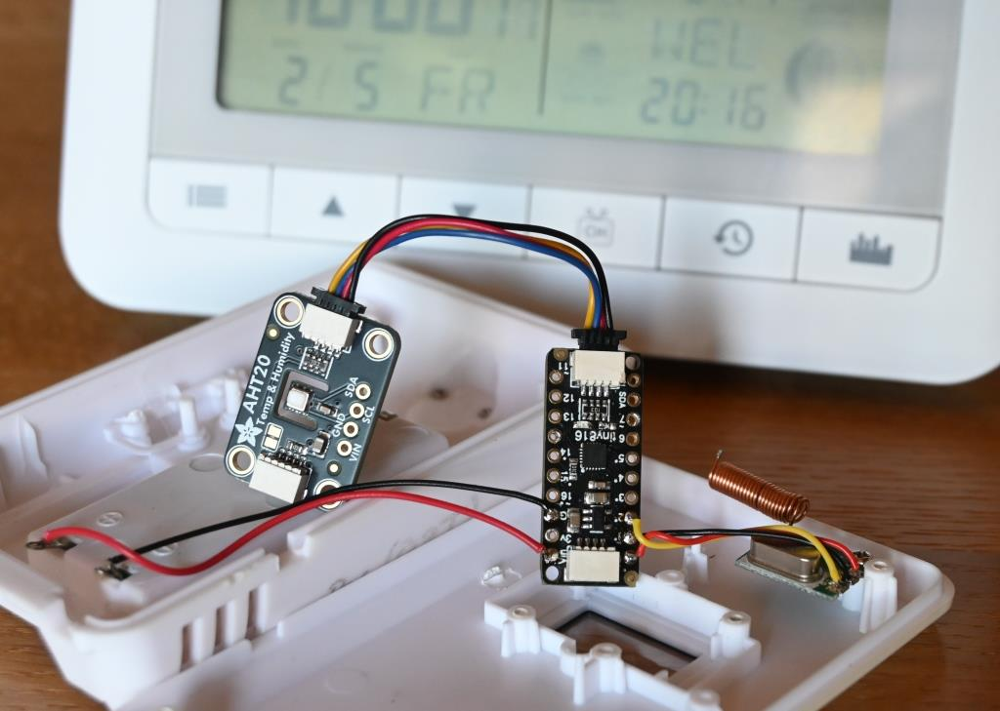

# Bresser weather sensor

I've been using a weather station from Bresser for several years. Unfortunately, the outdoor sensors quit service after a relatively short period. A replacement sensor costs almost as much (including shipping) as the entire weather station. This was the moment I decided to build my own temperature & humidity sensor transmitting the values to the station.

## Hardware
* **Microcontroller:** Adafruit [ATtiny816](https://www.adafruit.com/product/5681) breakout board
* **Sensor:** Adafruit [AHT20](https://www.adafruit.com/product/4566) breakout board
* **Transmitter:** re-used from original sensor (433,920 MHz ASK)
* **Housing:** re-used from original sensor, with battery bay for 2xAAA (Micro) batteries

## Software
Software is a native C/C++ code built with *Atmel Studio*. The AHT20 sensor part was ported from Adafruit's Arduino library (https://github.com/adafruit/Adafruit_AHTX0).

### Logic
After switching on, the weather station registers the outdoor sensors, for which a transmission is triggered either by inserting the batteries or by pressing the test button. The sensor identifies itself with an ID between 0-255, which is randomly generated when switched on. This reduces the probability of a collision with identical sensors in the radio neighborhood. A maximum of 3 outdoor sensors can be registered in one weather station.
The transmission is then repeated every 60s containing the recently measured values. In order to conserve power, the weather station stores the time of the last transmissions and receives only after 60s have elapsed.

## Programming
Programming the device is done via *UPDI* interface (e.g. using Adafruit's UPDI Friend), together with *avrdude*.

### Fuses
* **OSCCFG** fuse must be set to 0x01 to use the 16 MHz clock (instead of 20 MHz default). 
  `avrdude-c serialupdi -p t816 -P COM1 -U fuse2:w:0x01:m`
* **BODCFG** fuse must be set to 0x18 to activate voltage monitoring (optional). 
  `avrdude -c serialupdi -p t816 -P COM1 -U fuse1:w:0x18:m`

## ./Concepts
This folder contains several evaluation projects. Description can be found inside the folder.
